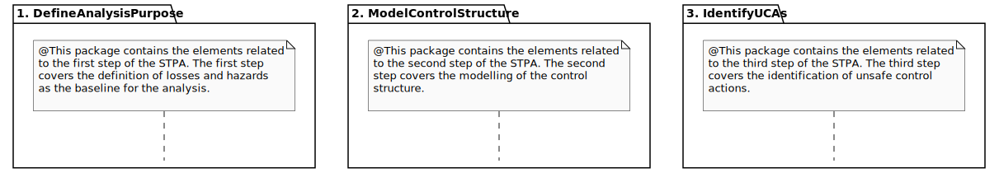
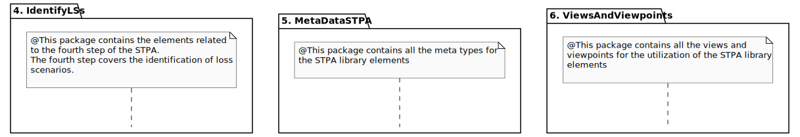

# About

The development of complex transport systems presents significant safety challenges. While safety-driven and model-based approaches show promise, their adoption is still in its early stages. One hazard analysis method that is gaining traction is the System Theoretic Process Analysis (STPA). Integrating STPA with the Systems Modeling Language (SysML) holds great potential, thanks to their shared system-theoretic foundation. Simultaneously, SysML v2, with extensibility features such as libraries, offers new integration opportunities. Accordingly, this repo proposes an open-source SysML v2 library for STPA.

This repo contains:
- A library for STPA in the textual notation of SysML v2 - [LinkToLibrary](Library/LibrarySTPA.sysml)
- A corresponding example project that uses the library - [LinkToExample](Library/ExampleSTPA.sysml)
- A jupyter notebook version that showcases the application - [LinkToNotebook](Jupyter/LibrarySTPA.ipynb)

The library is devided into six packages. For each of the four STPA steps, one dedicated package is used. The fifth and sixth package includes the metadata types and view/viewpoint definitions that facilitate the application of the library.

# License and Copyright

For this library the copyright belongs to the German Aerospace Center / Deutsches Zentrum für Luft- und Raumfahrt e.V. (DLR):

Copyright (c) 2025 Deutsches Zentrum für Luft- und Raumfahrt e.V. (DLR)

Licensed under MIT + Apache 2.0. That means, as a downstream consumer of this software you may
choose to either use it under MIT or under Apache 2.0 license, at your discretion. All contributions
from upstream must be licensed under both MIT and Apache 2.0; if you contribute code to this project
you agree to license your code under both the MIT and the Apache 2.0 license.
