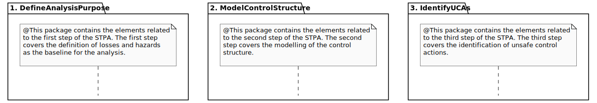
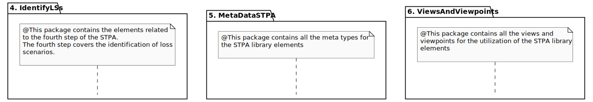
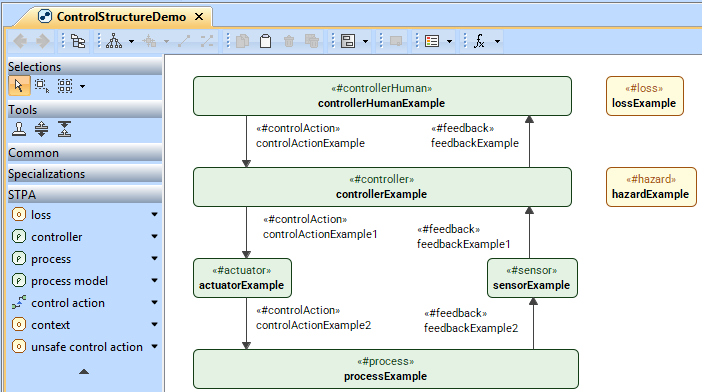
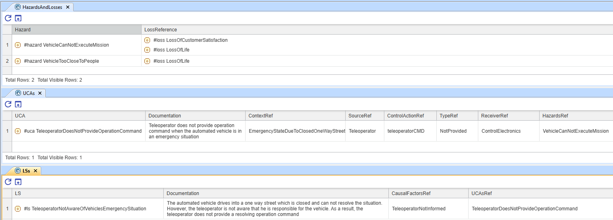

# About

The development of complex transport systems presents significant safety challenges. While safety-driven and model-based approaches show promise, their adoption is still in its early stages. One hazard analysis method that is gaining traction is the System Theoretic Process Analysis (STPA). Integrating STPA with the Systems Modeling Language (SysML) holds great potential, thanks to their shared system-theoretic foundation. Simultaneously, SysML v2, with extensibility features such as libraries, offers new integration opportunities. To try the integration, an open-source SysML v2 library for STPA was created.

This repo contains:
- A library for STPA in the textual notation of SysML v2 - [LinkToLibrary](Library/LibrarySTPA.sysml)
- A corresponding example project that uses the library - [LinkToExample](Library/ExampleSTPA.sysml)
- A jupyter notebook version that showcases the application - [LinkToNotebook](Jupyter/LibrarySTPA.ipynb)
- A Cameo specific extension that includes advanced views and diagram definitions - [LinkToCameoViews](Library/CameoViewsSTPA.sysml)

The library is divided into six packages. For each of the four STPA steps, one dedicated package is used. The fifth and sixth package include the metadata types and view/viewpoint definitions that facilitate the application of the library.

-----------------------------------------------------------------------------------------------

# Usage

The LibrarySTPA.sysml and ExampleSTPA.sysml files of the library can be used with any SysML v2 tool. The LibrarySTPA.ipynb file is recommended to be used in combination with the pilot-implementation for [Jupyter](https://github.com/Systems-Modeling/SysML-v2-Release/tree/master/install/jupyter). Some tools for trying out the library are:

- Jupyter - [LinkToGithub](https://github.com/Systems-Modeling/SysML-v2-Release/tree/master/install/jupyter)
- SysIDE (VSC Plugin) - [LinkToWebsite](https://sensmetry.com/syside/)
- Cameo Community Edition - [LinkToWebsite](https://discover.3ds.com/free-catia-sysmlv2-community-edition)
- SysON - [LinkToWebsite](https://mbse-syson.org/)

For [Cameo](https://discover.3ds.com/free-catia-sysmlv2-community-edition) users, advanced tool features allow defining and using specific extensions such as:

[STPA-specific diagrams](Library/CameoViewsSTPA.sysml) that support the graphical creation of library elements

[Tabular views](Library/CameoViewsSTPA.sysml) to show: relations between hazards and losses, or the model-based composition of UCAs and LSs

More information on the goals and concepts behind the library is available in the corresponding [open-access article](https://doi.org/10.1002/sys.70057)

-----------------------------------------------------------------------------------------------

# Related Material

Related References from Contributors:
- [**Extending SysML v2 for Safety - Open-Source Library for the System-Theoretic Process Analysis**](https://doi.org/10.1002/sys.70057)
- [A System-Theoretic Assurance Framework for Safety-Driven Systems Engineering](https://doi.org/10.1007/s10270-024-01209-6)
- [Tailoring STPA for SOTIF: Terminology Mapping and Methodological Extension](https://doi.org/10.1109/ACCESS.2025.3636728)

Recommended STPA Literature:
- [MIT Partnership for Systems Approaches to Safety and Security (PSASS)](http://psas.scripts.mit.edu/home/materials/)
- [STPA Handbook 2018](http://psas.scripts.mit.edu/home/get_file.php?name=STPA_handbook.pdf)
- [Engineering A Safer World](https://doi.org/10.7551/mitpress/8179.001.0001)
- [STPA Standard for All Industries](https://doi.org/10.4271/J3307_202503)
- [SAE J3187 STPA Guidance](https://doi.org/10.4271/J3187_202305)
- [Podcasts about STPA](https://safetycorner.wagnerflorian.eu/index.php/en/)

-----------------------------------------------------------------------------------------------

# License and Copyright

For this library the copyright belongs to the German Aerospace Center / Deutsches Zentrum für Luft- und Raumfahrt e.V. (DLR):

Copyright (c) 2025 Deutsches Zentrum für Luft- und Raumfahrt e.V. (DLR)

Licensed under MIT + Apache 2.0. That means, as a downstream consumer of this software you may
choose to either use it under MIT or under Apache 2.0 license, at your discretion. All contributions
from upstream must be licensed under both MIT and Apache 2.0; if you contribute code to this project
you agree to license your code under both the MIT and the Apache 2.0 license.

-----------------------------------------------------------------------------------------------

# Contact Information

The main contributor of the library is Alexander Ahlbrecht:
- [LinkedIn](https://www.linkedin.com/in/alexander-ahlbrecht-411907225/)
- [ResearchGate](https://www.researchgate.net/profile/Alexander-Ahlbrecht)
- [GoogleScholar](https://scholar.google.com/citations?user=XildzN5o6jAC&hl=de&oi=ao)

In case of questions, you can also write a mail to: alexander.ahlbrecht@dlr.de
